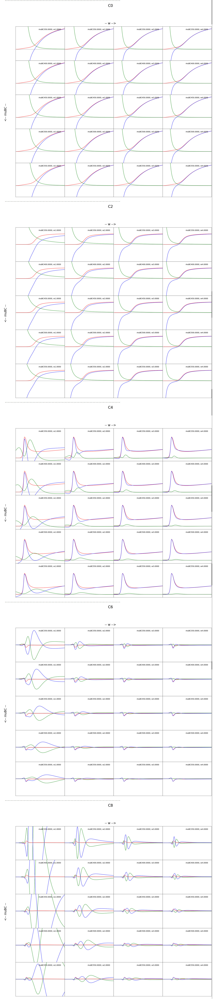

# Autorun EoS Code and Grapher
This repo has two codes. One that autoruns another code many times over depending on the ranges of input values required by the user, and the other that allows the user to graph in various ways the results of the autorun code. This readme includes
1. [Why These Codes Matter and Results](#why-these-codes-matter-and-results)
2. [Autorunner Information](#autorunner)
3. [Grapher Information](#grapher)

## Why These Codes Matter and Results
#### The Obstacle
The group was trying to investigate the effects of varying input parameters for a code outputting thermodynamic quantities. From here on that thermodynamic quantities code will simply be referred to as the EoS (Equation of State code). However, with all the possible input parameters and their ranges, investigating the results of all possible permutations was practically impossible. The group needed a easy and quick method to see the results of running the code with all sorts of input parameters. 

#### The Solution and Results
The solution was developing code that allowed the group to autorun the EoS for any set of input parameters, organize the data in properly titled directories, and then graph any of the results in the desired manner of the user. The end result is the image below. You can see that there are many plots all organized based on what the user requests and the x and y axes display changes in certain parameters against one another. In this case, those parameters are w vs muBC. The physical details of the results aren't the most important part of this repo, but to demostrate how something entirely daunting became visually comprehensible with the automated code. 

The group was able to investigate the effects of changing parameters against each other. This lead to the group being able to determine the best input data for the EoS. 

[Back to Top](#autorun-eos-code-and-grapher)

---
---
## Autorunner
This code generates EoS outputs for all combinations of parameters requested. All outputs once code is complete can be found in main_output_dir.

#### General Procedure
1. from the all_order_eos directory, copy and paste the desired EoS.cpp version into the EoS_1/src/ directory. These different versions are for different orders of the taylor expansion. Rename the pasted .ccp file to EoS.cpp. Once that is complete, from the EoS_1 directory run make.
*this step only needs to be done once if you plan on reusing the same version of EoS.cpp.
*if you have already run auto_eos with a different order coefficient and have changed it, you must delete all the eos in EoS_others. If not auto_EoS will run with older versions. Just input how many EoS you want again in step 3.

2. Ensure that the Lattice_Data file in the main directory is the correct one.

3. run auto_EoS.ipynb and complete the prompts.

4. auto_EoS will then generate all material requested in the fashion requested. All final outputs (Files_...) in all /output directories will be moved to the main_output_dir. 

#### Notes
Do not remove the /EoS_others directory. Additional instances of the EoS program will be generated there if requested.

EoS_runner.py in the EoS_1 and subsequent eos instances directories is what actually runs the ./EoS input/parameters_dir/parameter_file command. It will do so for each parameter file assigned to its corresponding input/parameters_dir/ directory. EoS_runner.py then moves outputs to main_output_dir.

This code does not indicate on the output files which order version of the EoS.cpp file is being used. So make sure to keep track manually of which folders in the main_output_dir are from which version of EoS.cpp.

[Back to Top](#autorun-eos-code-and-grapher)

## Grapher
This code generates grids of plots of the chis_ files for the y and x axis parameters requested.

#### General Procedure

1. ensure that main_output_dir has the data you want to plot

2. run 1st cell in 2d_plotter.ipynb and complete prompts. This creates the lists of what you want to pull from main_output_dir.

3. run 2nd cell in 2d_plotter.ipynb. This does the plotting. 

#### Notes
Both 1st and 2nd cells can be combined into one cell and run together (can also put into .py if desired). It is split for convenience if you want to make adjustments to x and y ranges for each coef plot. If so simply make changes in y_ranges_list and x_ranges_list.

Further modifications to the figure and plots can be made in either the section named "# make the plots..." or in the plotter() function.

[Back to Top](#autorun-eos-code-and-grapher)
